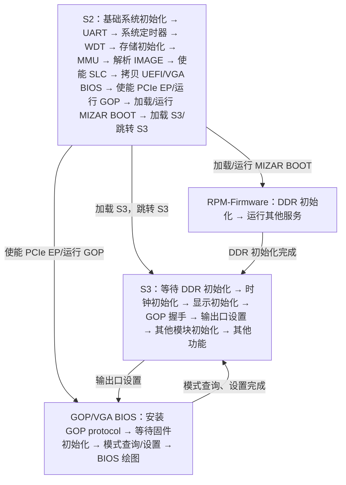
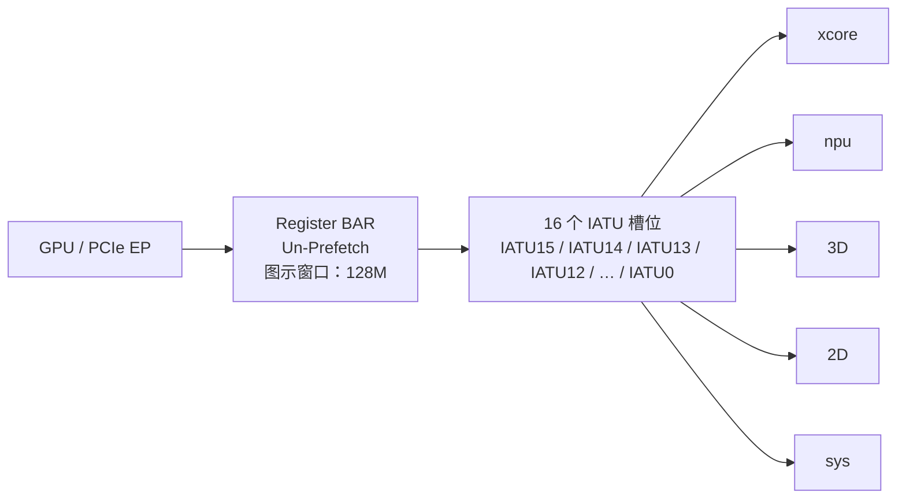
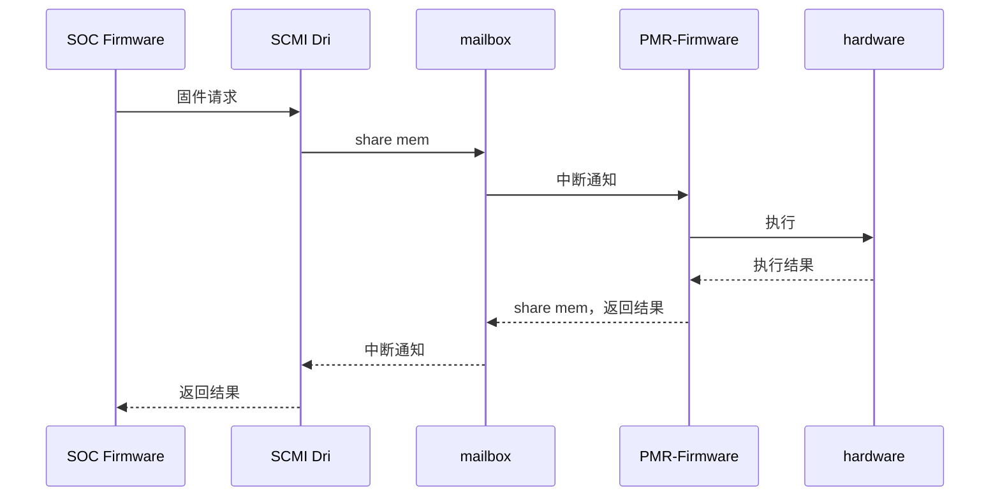
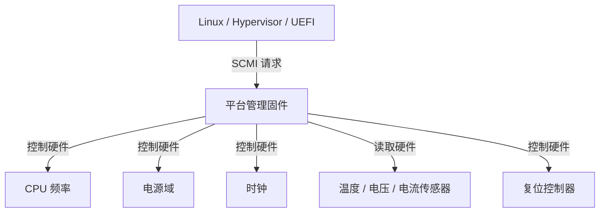
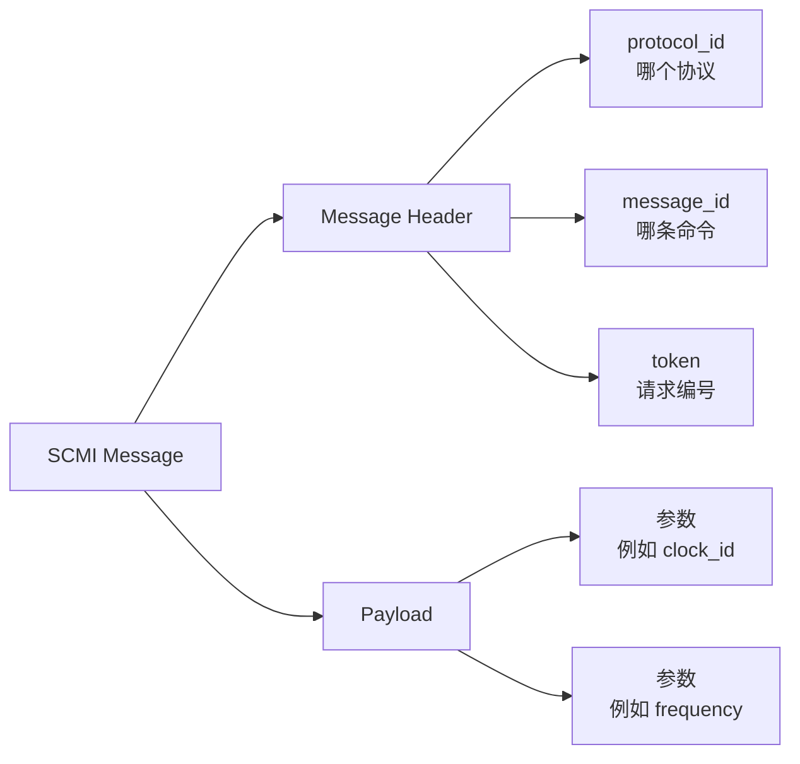
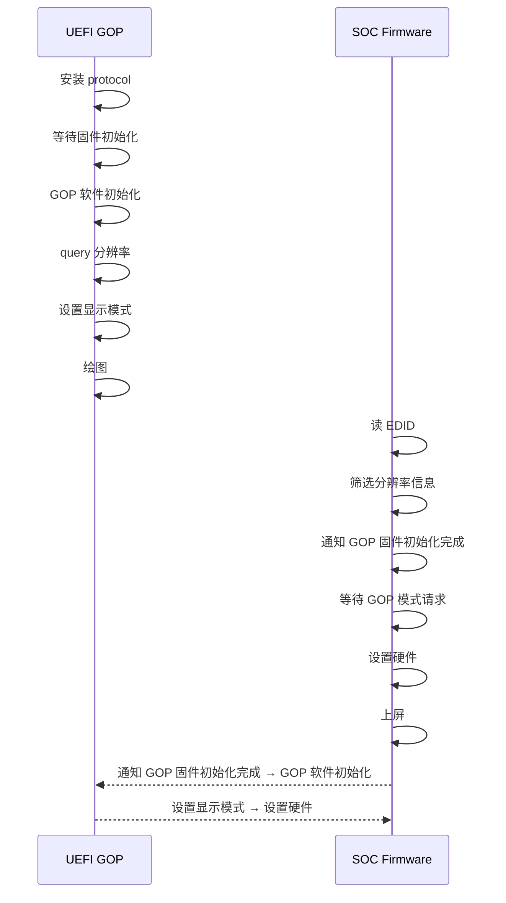

# MWV701_XX 固件方案设计

## 文档信息

| 项目 | 内容 |
|---|---|
| 项目 | MWV701 |
| 文档编号 | 未填写 |
| 版本 | 0.0.1 |
| 作者 | 未填写 |
| 原始文档名称 | MWV701_XX 固件方案设计 |

> 本文档由原始 DOCX 转写为纯 Markdown。原文中的流程图、架构图和其他图片均已转换为 Mermaid 文本图、表格和文字化连线说明，本文档不包含任何图片。

## 转写说明与原文疑点

- 原始 DOCX 的目录字段与正文页面上显示的自动编号不一致。本文档按正文实际内容组织为第 1～11 节，并保留原目录信息供比对。
- 原文中同时出现 `RPM-Firmware` 和流程图中的 `PMR-Firmware`。正文语义均指 RPM-Firmware；流程图转写时保留图中的名称，并在说明中指出该差异。
- 原文有部分字段为空、部分地址旁存在孤立字符或大小写不一致。空字段统一写为“未填写”；技术数值尽量按原文保留，疑似排版残留单独说明。

## 原文目录字段

原文目录中显示的条目如下。目录页中的页码属于原始 DOCX 的版式信息，Markdown 中不再依赖页码定位。

| 原目录编号 | 原目录条目 |
|---|---|
| 1 | 启动流程 |
| 2 | 内存分配 |
| 2.1 | SRAM 分配 |
| 2.2 | 固件地址分配 |
| 3 | PCIE 映射 |
| 4 | 核间通信 |
| 4.1 | Mailbox |
| 4.2 | Share MEM |
| 4.3 | SCMI |
| 5 | 时钟控制 |
| 6 | 固件显示 |
| 6.1 | 分辨率设置 |
| 7 | 温度控制 |
| 8 | 固件日志 |

# 1. 文档目的

原文未填写具体内容。

# 2. 适用范围

本文档适用于以下工程师进行产品设计、开发和调试指导：

- 软件工程师
- 系统工程师
- 硬件工程师
- 芯片验证工程师

# 3. 软件方案整体描述

原文未填写独立的概述段落。

# 4. 固件启动流程

作为 EP 模式，必须满足快速启动要求。SOC-Firmware 拆分为两部分：S2 和 S3。

- S2 主要完成系统基础初始化、必要的硬件初始化、PCIe、UEFI GOP/VGA BIOS 加载以及 RPM-Firmware 加载。
- 其他功能全部放在 S3 中完成。
- RPM-Firmware 负责 DDR 初始化，并运行其他服务。
- S3 等待 DDR 初始化完成后，继续执行时钟初始化、显示初始化、GOP 握手、输出口设置、其他模块初始化及其他功能。
- GOP/VGA BIOS 负责安装 GOP protocol、等待固件初始化、进行模式查询与设置，并执行 BIOS 绘图。

## 4.1 启动流程图的文字化转写

### 4.1.1 S2 执行步骤

S2 中的执行顺序为：

1. 基础系统初始化。
2. UART 初始化。
3. 系统定时器初始化。
4. WDT 初始化。
5. 存储初始化（`io setup`）。
6. MMU 初始化。
7. 解析 IMAGE。
8. 使能 SLC。
9. 拷贝 UEFI/VGA BIOS。
10. 使能 PCIe EP 并运行 GOP。
11. 加载并运行 MIZAR BOOT。
12. 加载 S3，并跳转到 S3。

### 4.1.2 各固件模块之间的关系



### 4.1.3 流程图中的完整节点与连线

为避免 Mermaid 渲染差异，原图信息进一步展开如下：

#### S2 节点

```text
S2
├─ 基础系统初始化
├─ UART
├─ 系统定时器
├─ WDT
├─ 存储初始化（io setup）
├─ MMU
├─ 解析 IMAGE
├─ 使能 SLC
├─ 拷贝 UEFI/VGA BIOS
├─ 使能 PCIE EP/运行 GOP
├─ 加载/运行 MIZAR BOOT
└─ 加载 S3，跳转 S3
```

#### S3 节点

```text
S3
├─ 等待 DDR 初始化
├─ 时钟初始化
├─ 显示初始化
├─ GOP 握手
├─ 输出口设置
├─ 其他模块初始化
└─ 其他功能
```

#### 原图中的跨模块连线

| 起点 | 方向 | 终点 | 含义 |
|---|---|---|---|
| S2：使能 PCIE EP/运行 GOP | → | GOP/VGA BIOS 模块 | S2 启动并运行 GOP |
| S2：加载/运行 MIZAR BOOT | → | RPM-Firmware | 加载并启动 RPM-Firmware |
| S2：加载 S3，跳转 S3 | → | S3 | S2 将执行权交给 S3 |
| RPM-Firmware：DDR 初始化 | → | S3：等待 DDR 初始化之后的流程 | DDR 初始化完成后，S3 继续执行 |
| S3：输出口设置 | → | GOP/VGA BIOS：模式查询、设置 | S3 与 GOP/VGA BIOS 交互完成输出口模式设置 |
| GOP/VGA BIOS：模式查询、设置 | → | S3：其他模块初始化 | GOP 模式设置完成后返回 S3 |

# 5. 内存分配

701 SOC 芯片有两块 SRAM 区域，以及一块文档中称为“8M LSC”的区域，地址分别如下。

## 5.1 SRAM 分配

| 名称 | 起始地址 | 结束地址 | 大小 | 功能 |
|---|---:|---:|---:|---|
| `PER_MEM` | `0x10000000` | `0x1003FFFF` | 256K | S2 |
| `AO_MEM` | `0x04000000` | `0x0403FFFF` | 256K | RPM |
| `SLC` | `0x30000000` | `0x30600000` | 6M | S3 |
| `SLC` | `0x30700000` | `0x30740000` | 256K | GOP |

### 5.1.1 GOP/VGA BIOS 的 SRAM 加载约束

701 SOC 芯片不支持 PCIe EP 直接访问 Flash，因此需要执行以下操作：

1. 通过 DMA 引擎将 GOP/VGA BIOS 程序从 Flash 拷贝到 SRAM 区域。
2. PCIe 扩展 ROM BAR 从 SRAM 区域加载 BIOS。

PCIe BAR 映射需要满足以下要求：

```text
size = 2 ^ n
Base_addr % size == 0
```

所有区域均能满足上述要求。GOP 和 VGA BIOS 程序小于 256K，因此使用 `0x30700000` 存放 GOP/VGA BIOS 可以满足要求。

## 5.2 固件地址分配

SOC-Firmware 程序分为两个区域：S2 和 S3。

- S2 在 `PER_MEM` 中运行。
- S3 在 `SLC` 中运行。

### 5.2.1 `PER_MEM`

| 起始地址 | 结束地址 | 大小 | 功能 |
|---:|---:|---:|---|
| `0x10000000` | `0x1003FFFF` | 256K | BL2 程序 |

### 5.2.2 `SLC`

| 起始地址 | 结束地址 | 大小 | 功能 |
|---:|---:|---:|---|
| `0x30000000` | `0x300FFFFF` | 1M | S3 固件程序 |
| `0x30100000` | `0x30103FFF` | 16K | 固件 log |
| `0x30104000` | `0x30107FFF` | 16K | GOP log |
| `0x30108000` | `0x301083FF` | 1K | 固件驱动交互 |
| `0x30108400` | `0x301087FF` | 1K | 固件和 GOP 交互 |
| `0x30108800` | `0x307BFFFF` | 未填写 | 保留 |

# 6. PCIE 映射

由于只有 PCIe0 连接了中断控制器，且只有 PCIe0 具有 DMA，因此在 701 SOC EP 模式下使能 PCIe0 为 EP 模式。PCIe0 EP 的 BAR 配置和属性如下。

## 6.1 PCIe BAR 配置

| 名称 | BAR 索引 | 属性 | 映射地址 | 大小 | 说明 |
|---|---|---|---:|---:|---|
| Memory BAR | BAR0、BAR1 | 64 bit / Prefetch | `0x40000000` | 256M | 帧存 BAR |
| Register BAR | BAR2 | 32 bit / Un-Prefetch | `0x04000000` | 128M | 寄存器 BAR |
| 保留 | BAR3 | `/` | 未填写 | `/` | 保留 |
| IATU BAR | BAR4 | 未填写 | 默认值 | 1M | PCIe 配置空间 |
| IO BAR | BAR5 | 32 bit / Un-Prefetch | 未填写 | 1M | VGA BIOS IO 访问 |
| 扩展 ROM BAR | 扩展 ROM BAR | 未填写 | `0x307C0000` | 256K | 未填写 |

## 6.2 IATU 映射设计

701 SOC 芯片的寄存器地址分散，且 Register BAR 受到 Un-Prefetch 属性限制，最大只支持 256M，无法将全部寄存器地址空间一次性映射。因此，需要 GPU 内核驱动程序通过 IATU 转换单元，将 Register BAR 的地址映射到各个目标地址区域。

PCIe EP 最多支持 16 个 IATU。

### 6.2.1 IATU 示意图的文字化转写

图中展示以下层次关系：

- GPU 侧通过 PCIe EP 访问 Register BAR。
- Register BAR 在图中标注为 Un-Prefetch，并以 128M 的箭头表示其可见窗口。
- Register BAR 窗口内部包含多个 IATU 槽位，图中显式标出 `IATU15`、`IATU14`、`IATU13`、`IATU12`、省略号和 `IATU0`。
- IATU 槽位将 Register BAR 窗口内的不同地址段转换到全局地址空间。
- 全局地址空间示意区域包括 `xcore`、`npu`、`3D`、`2D`、省略号和 `sys`。
- 图中关系可概括为：`GPU → Register BAR → IATU[n] → 全局地址区域`。



### 6.2.2 IATU 配置表

| IATU 索引 | Source Start | Source End | Size | Target Start | Target End | 说明 |
|---:|---:|---:|---:|---:|---:|---|
| 16 | `0x18A00000` | `0x18C00000` | 2M | `0x04100000` | `0x04200000` | NPU |
| `/` | `0x04400000` | `0x04500000` | 1M | `0x04400000` | `0x04500000` | NPU（不做映射） |
| 15 | `0x38C00000` | `0x38D00000` | 1M | `0x04200000` | `0x04300000` | 未填写 |
| 14 | `0x2C000000` | `0x2D000000` | 16M | `Todo` | `todo` | Xcore |

> 原图 IATU 索引 16 的 `Source Start` 单元中，在 `0x18A00000` 下方还显示了一个孤立的 `0`。根据地址范围和 2M 大小，该地址按 `0x18A00000` 转写；孤立字符作为疑似排版残留保留在本说明中。

> 原文表头写作 `Tart end`，此处按字段含义规范化为 `Target End`。

> 原文写有“其余地址由模块负责任填写，不在映射范围内需要做地址转换”。

# 7. 核间通信

701 EP 的时钟配置和电源配置在 RPM-Firmware 中完成。SOC-Firmware 通过核间通信向 RPM-Firmware 发送调压和调频请求，RPM-Firmware 完成操作后，将结果反馈给 SOC-Firmware。

核间通信采用 SCMI、Mailbox 和 Share MEM 三种方式配合完成。

## 7.1 Mailbox

### 7.1.1 Mailbox 流程图的文字化转写

原图从左到右包含以下参与者：

`SOC Firmware`、`SCMI Dri`、`mailbox`、`PMR-Firmware`、`hardware`。



### 7.1.2 原图逐条消息

1. SOC Firmware 向 SCMI Dri 发送“固件请求”。
2. SCMI Dri 将请求通过 `share mem` 交给 mailbox。
3. mailbox 向 PMR-Firmware 发送“中断通知”。
4. PMR-Firmware 通知 hardware 执行。
5. hardware 将执行结果返回给 PMR-Firmware；原图该返回箭头未标注文字。
6. PMR-Firmware 通过 `share mem` 向 mailbox 返回结果。
7. mailbox 向 SCMI Dri 发送“中断通知”。
8. SCMI Dri 将结果返回给 SOC Firmware；原图该返回箭头未标注文字。

> 正文统一使用 `RPM-Firmware`，而 Mailbox 原图顶部节点显示为 `PMR-Firmware`。本文档保留该差异，不判断其是否为原始笔误。

## 7.2 Share MEM

Share MEM 的地址和长度如下：

| 项目 | 数值 |
|---|---:|
| 起始地址 | `0x04240100` |
| 长度 | 100 字节 |

## 7.3 SCMI

SCMI（系统控制与管理接口）是一种让操作系统或上层软件以标准化方式请求底层固件管理硬件资源的协议，主要用于 Arm 平台。通过标准消息，底层固件可以控制硬件资源。

SOC-Firmware 和 RPM-Firmware 之间使用 SCMI 协议通信。SCMI 的详细介绍参考《MWV701_RPM-Firmware 软件方案》。

### 7.3.1 SCMI 资源控制关系



原图包含以下节点和边：

| 起点 | 标签 | 终点 |
|---|---|---|
| Linux / Hypervisor / UEFI | SCMI 请求 | 平台管理固件 |
| 平台管理固件 | 控制硬件 | CPU 频率 |
| 平台管理固件 | 控制硬件 | 电源域 |
| 平台管理固件 | 控制硬件 | 时钟 |
| 平台管理固件 | 读取硬件 | 温度/电压/电流传感器 |
| 平台管理固件 | 控制硬件 | 复位控制器 |

### 7.3.2 SCMI 消息格式

SCMI 消息由消息头（Message Header）和 Payload 组成。



结构化表示如下：

```text
SCMI Message
├─ Message Header
│  ├─ protocol_id：哪个协议
│  ├─ message_id：哪条命令
│  └─ token：请求编号
└─ Payload
   ├─ 参数，例如 clock_id
   └─ 参数，例如 frequency
```

# 8. 时钟控制

EP 模式下，时钟统一由 RPM-Firmware 控制。SOC 固件端通过向 RPM-Firmware 发送调频请求设置时钟频率。

时钟控制的详细配置参考《MWV701_RPM-Firmware 软件方案》。

这里只列出固件明确需要使用的时钟；如有其他需要配置或使用的时钟，再另行补充。

## 8.1 SCMI 时钟消息

| Protocol | Message ID | Payload | Status | 说明 |
|---:|---:|---|---|---|
| `0x14` | `0x005` | `0: PLL_TOP`<br>`6: PLL_DPU0`<br>`7: PLL_DPU1`<br>`26: AO_UART0_CLK` | 未填写 | 设置频率 |
| `0x14` | `0x006` | `0: PLL_TOP`<br>`6: PLL_DPU0`<br>`7: PLL_DPU1`<br>`26: AO_UART0_CLK` | 未填写 | 读频率 |

> 原文表头写作 `Protocal`，此处规范化为 `Protocol`；`Status` 列在原文中为空。

# 9. 固件显示

EP 模式下，固件阶段最大支持两路 HDMI 显示。两路显示只支持复制模式，不支持扩展模式。

当接入两个规格不一样的显示器时：

1. 如果两个显示器存在共同支持的分辨率，固件选择两个显示器同时支持的分辨率。
2. 如果两个显示器没有共同支持的分辨率，则选择其中一款显示器的最佳分辨率。

固件显示阶段不支持 HDMI 热插拔，默认强制打开两路 HDMI 输出显示。

## 9.1 分辨率设置

### 9.1.1 GOP 与 SOC Firmware 的显示流程

原图包含两个泳道：左侧为 `UEFI GOP`，右侧为 `SOC Firmware`，中间使用虚线分隔。



为精确表达原图中的节点和箭头，流程也可以写成以下两条并行链：

```text
UEFI GOP：
安装 protocol
  ↓（等待固件初始化）
GOP 软件初始化
  ↓
query 分辨率
  ↓
设置显示模式 ───────────────→ SOC Firmware：设置硬件
  ↓
绘图

SOC Firmware：
读 EDID
  ↓
筛选分辨率信息
  ↓
通知 GOP 固件初始化完成 ────→ UEFI GOP：GOP 软件初始化
  ↓（等待 GOP 模式请求）
设置硬件
  ↓
上屏
```

### 9.1.2 GOP 分辨率来源及优先级

GOP 提供给 BIOS 的所有模式信息由固件提供，固件模式信息有三种来源：

1. 配置工具强制配置。
2. 主板 BIOS 强制的 EDID。
3. 显示器 EDID，或者输出口强制配置的 EDID。

优先级为：

```text
1 > 2 > 3
```

处理规则：

- 固件向 BIOS 提供优先级最高来源对应的模式。
- 如果模式来源选择 EDID，且存在多个 EDID，则解析所有输出口的 EDID。
- 多个输出口的 EDID 解析完成后，取所有输出口支持分辨率的交集。
- 如果没有合适的模式，或者 BIOS 没有选择任何一种模式，则使用默认模式 `1024x768`。

### 9.1.3 VGA BIOS

VGA BIOS 提供给主板 BIOS 的可选源分辨率如下：

- `640x480x60HZ`
- `800x600x60H`（原文未写末尾 `Z`，按原文保留）
- `1024x768x60HZ`
- `1280x1024x60HZ`

其他规则：

- 像素格式可选为 `RGBA8888` 和 `RGB565`。
- 如果主板 BIOS 没有选择任何一种分辨率，则固件使用默认源分辨率 `1024x768x60HZ`。
- 上屏分辨率默认与源分辨率保持一致，上屏时不做分辨率缩放。
- UEFI GOP 和 VGA BIOS 基于 207D 的程序修改。

# 10. 温度控制

原文温度控制表如下：

| 芯片等级 | 热保护动作 |
|---|---|
| 商业级 | 工作温度范围 `-40～85°C`；温度 `>80°C` 时降频 50%？；温度 `>85°C` 时频率关断？；需要产品确定 |
| 工业级（原文写作“工业...”） | 未填写 |

> “降频 50%？”和“频率关断？”中的问号属于原文内容，表示方案当时尚未最终确认。

# 11. 固件日志

固件支持两种打印方式，具体使用哪一种通过配置选择：

1. 通过 UART 输出固件信息。
2. 将固件信息输出到 RAM 中的打印区。

## 11.1 RAM 打印区布局

| 区域 | 地址/范围 | 大小或含义 |
|---|---|---|
| 打印区起始地址 | `0x30100000` | 打印区起始地址 |
| 打印区 | `0x30100000` 起 | 16K |
| 起始偏移 | `0x30100000～0x30100001` | 保存打印数据的起始偏移 |
| 结束偏移 | `0x30100002～0x30100003` | 保存打印数据的结束偏移 |
| 打印信息 | `0x30100004` 开始 | 保存打印信息 |

当数据打印的结束偏移超过 `16K-4` 时，重新从偏移 `0` 开始打印数据。

